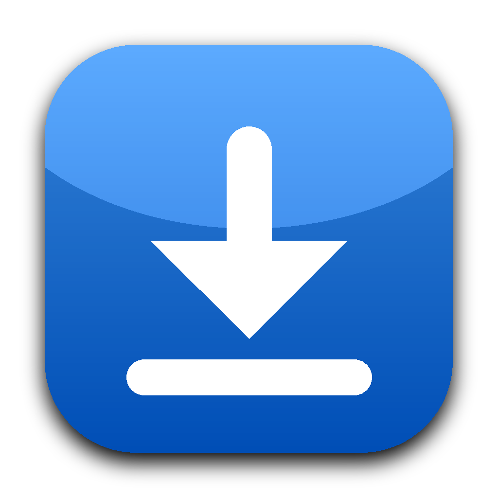
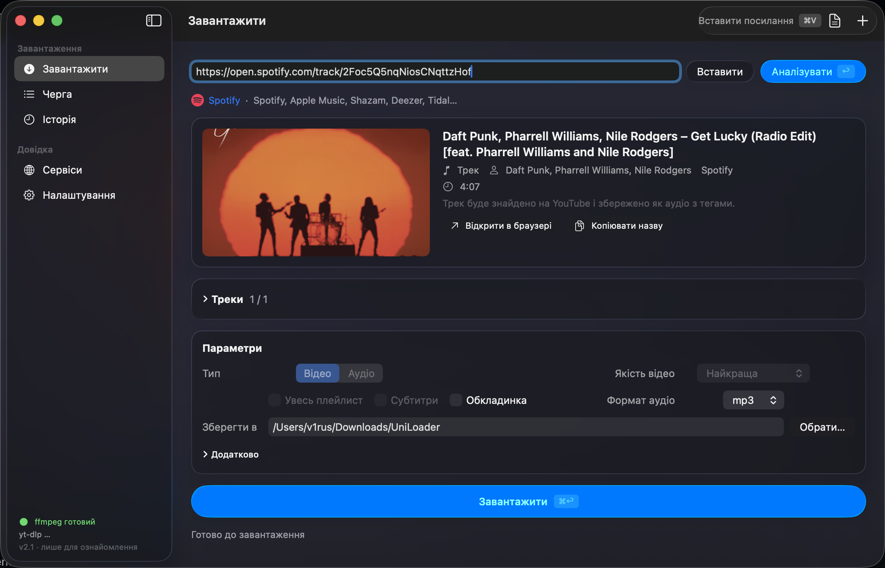
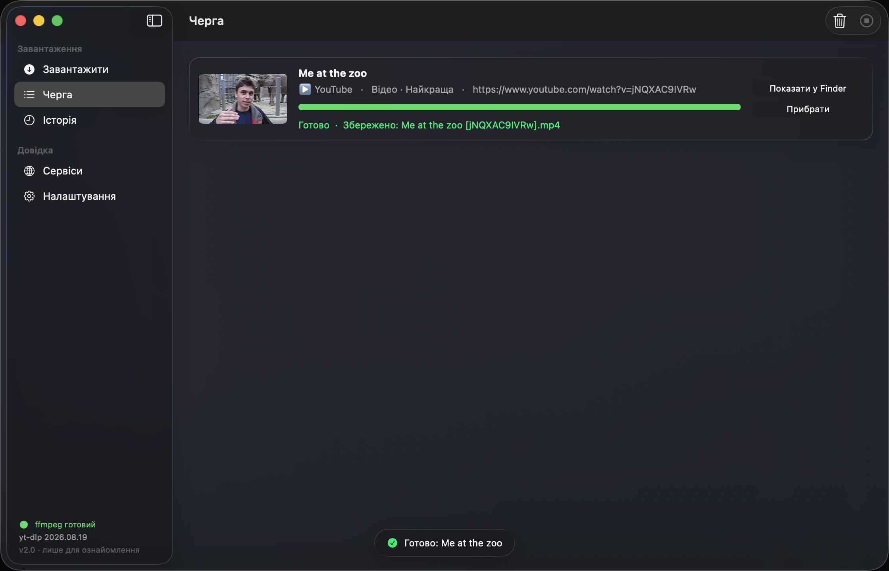
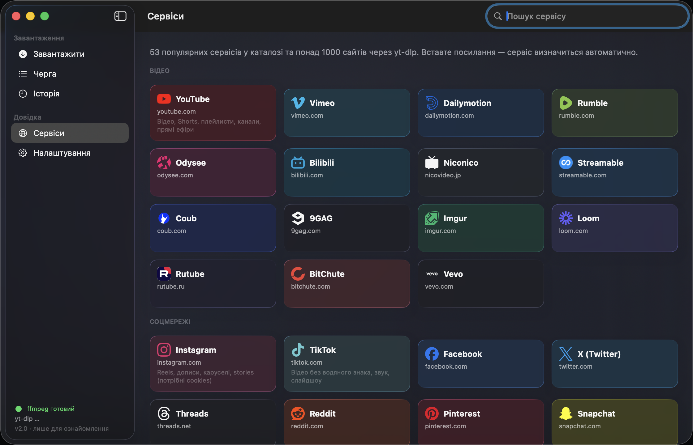
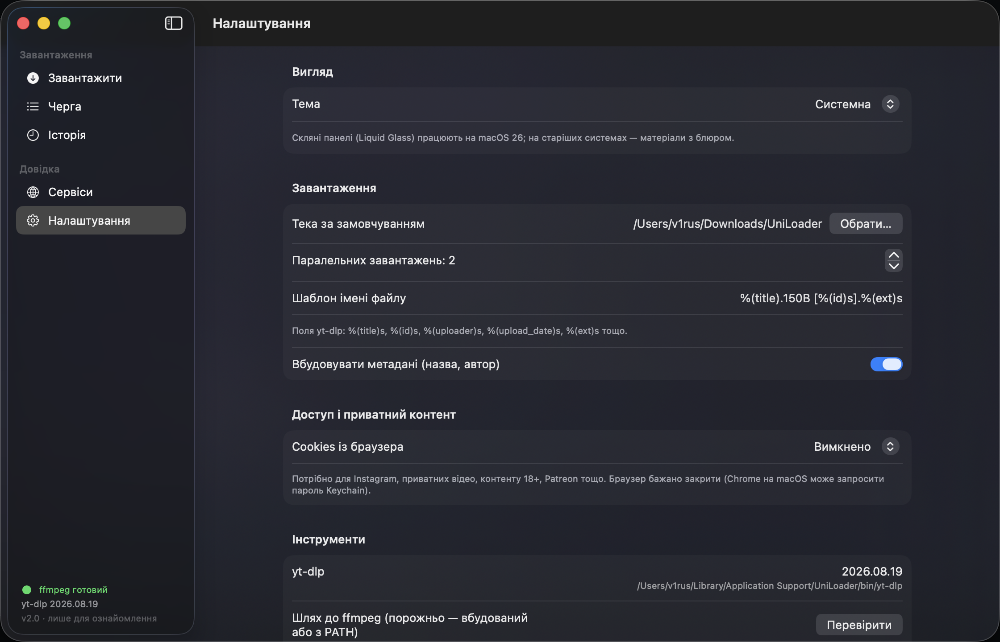

<p align="center">
  
</p>

<h1 align="center">UniLoader</h1>

<p align="center">
  A native macOS media downloader built with Swift and SwiftUI.<br>
  YouTube, Instagram, TikTok, X, Facebook, Reddit, Twitch, SoundCloud and 1000+ other sites via <a href="https://github.com/yt-dlp/yt-dlp">yt-dlp</a>,<br>
  plus Spotify, Apple Music, Shazam and Deezer links resolved to tagged audio.
</p>

<p align="center">
  <a href="README.uk.md">Українська</a> ·
  <a href="#features">Features</a> ·
  <a href="#install">Install</a> ·
  <a href="#build-from-source">Build</a> ·
  <a href="#how-music-links-work">Music links</a> ·
  <a href="#shortcuts">Shortcuts</a>
</p>

> **Educational project.** UniLoader is provided for learning purposes only. Download only content you have the right to download and respect the terms of service of each platform.



## Features

**Native macOS 26 look.** Liquid Glass sidebar, toolbar, cards and buttons (`glassEffect`), a translucent window background, unified toolbar with search, light and dark appearance. On macOS 14–15 the glass falls back to blurred materials.

**Any link, one paste.** Paste a link (⌘V works from any page, with any keyboard layout), drop it from the browser, or copy it in any app and let the clipboard watcher offer a download. Several links at once go straight to the queue; a text file with links can be imported with ⌘O.

**Analysis before download.** Title, uploader, duration, views, likes, upload date, thumbnail, exact format list with codec and file size, and a checkbox list of playlist items or album tracks.

**Video and audio.** Video from 360p to 4K merged into MP4, or a specific format ID; audio in mp3, m4a, opus, wav or flac; subtitles, cover art and metadata embedding; whole playlists or selected items.

**Music services.** Spotify, Apple Music, Shazam, Deezer (tracks, albums, playlists) and, on a best-effort basis, Tidal, Amazon Music and Yandex Music. Those services are DRM-protected, so UniLoader resolves the track list from the link and downloads each track from YouTube with proper artist, title and album tags. See [how music links work](#how-music-links-work).

**Queue you can trust.** 1–4 parallel downloads with live speed and ETA, cancel and retry, a per-task log with a copy button, the queue survives relaunches, Dock badge with the number of active downloads, notifications and a completion sound.

**Everywhere on your Mac.** Menu bar icon, a global quick panel on ⌘⇧D that floats above any app, a `uniloader://download?url=…` URL scheme and a ready-made bookmarklet for the browser.

**Power options.** Time-range sections, SponsorBlock, split by chapters, rate limit, proxy, arbitrary yt-dlp arguments, cookies from a browser or a `cookies.txt` file, custom filename template, weekly automatic yt-dlp update.

**History.** Search, Quick Look preview, reveal in Finder, drag files out to Finder or any other app, reuse a link.

**Self-contained.** The bundle ships a universal `yt-dlp` binary and a static `ffmpeg`; nothing else needs to be installed. Real brand logos for 60 services (Simple Icons, CC0). Ukrainian and English localization.

| Queue | Services | Settings |
|---|---|---|
|  |  |  |

## Install

Download `UniLoader-<version>.dmg` from [Releases](../../releases), drag the app to Applications.

The build is signed ad hoc, not notarized. On first launch right-click the app and choose **Open**, or run:

```bash
xattr -dr com.apple.quarantine /Applications/UniLoader.app
```

Requires macOS 14 Sonoma or newer; Liquid Glass needs macOS 26 Tahoe.

## Build from source

Only the Command Line Tools are required, Xcode is optional.

```bash
git clone https://github.com/v1rus91/UniLoader.git
cd UniLoader
./packaging/build.sh
open dist/UniLoader.app
```

The script downloads the universal `yt-dlp` binary and a static `ffmpeg` into `Resources/bin`, builds the release binary with SwiftPM, runs the built-in self-test, assembles `dist/UniLoader.app`, signs it ad hoc and creates a DMG.

For development:

```bash
swift build
.build/debug/UniLoader                      # run the app (tools are taken from Homebrew/PATH)
.build/debug/UniLoader --self-test          # 27 checks: parsers, argument builder, service detection
.build/debug/UniLoader --resolve <link>     # show how a music link is resolved into tracks
```

The same checks live in `Tests/` for Swift Testing (`swift test` under Xcode; the Command Line Tools cannot run the SwiftPM test runner, which is why the self-test exists).

## How music links work

Spotify, Apple Music, Shazam and Deezer stream DRM-protected audio that cannot be downloaded directly. UniLoader does what tools like spotDL do:

1. The link is parsed and the track list is fetched from a public source without any API key: the Spotify embed page, the iTunes Lookup API and Apple Music page JSON, Shazam and other sites via OpenGraph tags, the open Deezer API.
2. Each track becomes a `ytsearch1:"Artist - Title"` query for yt-dlp.
3. The best audio is downloaded from YouTube, converted to the chosen format and tagged with the real artist, title and album (`--parse-metadata`), optionally with the cover art embedded.

The result depends on YouTube search quality. Rare tracks or ambiguous titles may pick the wrong upload; the queue log shows which YouTube video was chosen.

## Shortcuts

| Keys | Action |
|---|---|
| ⌘V | Paste a link from the clipboard and analyze it (works outside text fields and with any keyboard layout) |
| ↩ | Analyze |
| ⌘↩ | Download |
| ⌘N | New download |
| ⌘O | Import links from a text file |
| ⌘L | Focus the link field |
| ⌘F | Search on the current page |
| ⌘1 … ⌘5 | Switch section |
| ⌘⇧D | Quick panel, globally from any app |
| ⌘, | Settings |
| ⌘/ | Shortcut cheat sheet |

## Project layout

```
Sources/UniLoader/
├── main.swift              # entry point, --self-test and --resolve CLI modes
├── UniLoaderApp.swift      # scenes: main window, quick panel, menu bar extra, commands
├── AppModel.swift          # UI state, actions, clipboard watcher, ⌘V monitor, URL scheme
├── DownloadManager.swift   # queue, workers, persistence, history, notifications, Dock badge
├── YTDLP.swift             # tool discovery, info fetch, argument builder, progress parser
├── MusicResolver.swift     # Spotify / Apple Music / Shazam / Deezer / OpenGraph → tracks
├── Models.swift            # options, tasks, media info, formatting helpers
├── Services.swift          # catalog of 60 services and URL detection
├── Prefs.swift             # UserDefaults-backed settings
├── HotKey.swift            # global hotkey (Carbon)
├── SelfTest.swift          # built-in checks
└── Views/                  # SwiftUI: Content, Download, Queue, History, Services, Settings, Components
packaging/                  # Info.plist, build.sh
Resources/                  # app icon, service logos, en.lproj, bin/ (downloaded at build time)
Tests/                      # Swift Testing suite
```

## Credits

[yt-dlp](https://github.com/yt-dlp/yt-dlp) does the actual downloading. [FFmpeg](https://ffmpeg.org) handles conversion. Service logos come from [Simple Icons](https://simpleicons.org) (CC0). The UI follows Apple's Human Interface Guidelines and the macOS 26 Liquid Glass design.

## License

MIT. For educational use only.
